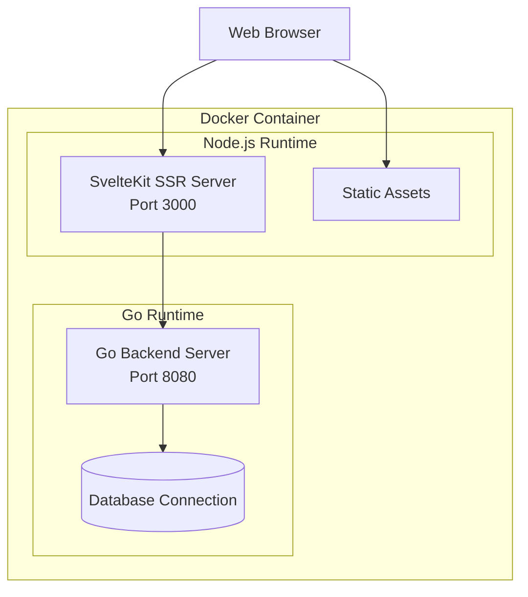
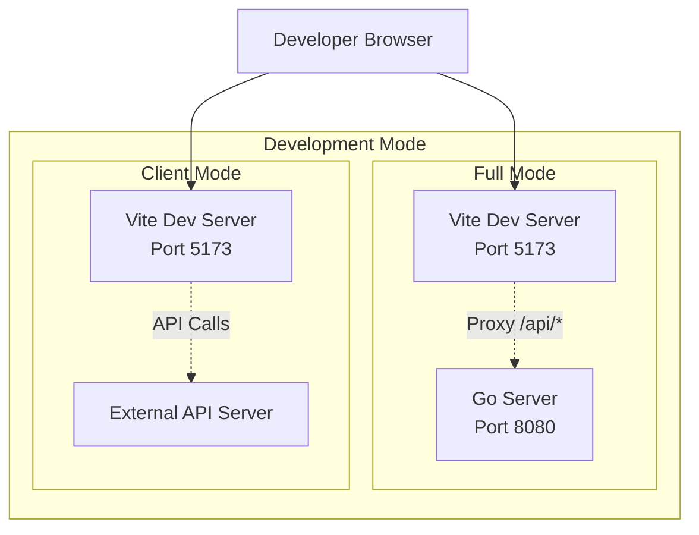

# Design Document

## Overview

The Docker integration solution combines the Go backend and SvelteKit frontend into a unified deployment package while maintaining efficient development workflows. The design uses a multi-stage Docker build approach and provides flexible development tooling to support both full-stack and frontend-only development scenarios.

## Architecture

### Production Architecture



### Development Architecture



## Components and Interfaces

### Docker Build Stages

#### Stage 1: Frontend Builder
- **Base Image**: `node:24.4-alpine`
- **Purpose**: Compile SvelteKit application with SSR support
- **Key Operations**:
  - Install dependencies using `npm ci`
  - Switch to `@sveltejs/adapter-node` for SSR
  - Build production-ready frontend bundle
  - Generate server-side rendering files

#### Stage 2: Backend Builder
- **Base Image**: `golang:1.24.4-alpine`
- **Purpose**: Compile Go application to static binary
- **Key Operations**:
  - Download Go modules
  - Build statically-linked binary
  - Optimize for production deployment

#### Stage 3: Runtime Container
- **Base Image**: `node:24.4-alpine`
- **Purpose**: Run both services in production
- **Key Operations**:
  - Copy compiled frontend from Stage 1
  - Copy Go binary from Stage 2
  - Install only production Node.js dependencies
  - Configure service startup

### Development Script Interface

#### Script: `dev.sh`
- **Location**: Project root
- **Modes**:
  - `full` (default): Start both backend and frontend
  - `client`: Start only frontend with external API
- **Functions**:
  - Dependency checking and installation
  - Service orchestration
  - Environment setup
  - Process management

### Service Communication

#### Production Communication
- **Internal**: Go backend runs on port 8080
- **External**: SvelteKit SSR serves on port 3000
- **API Routing**: SSR server proxies `/api/*` to Go backend
- **Static Assets**: Served directly by Node.js server

#### Development Communication
- **Frontend Dev Server**: Vite on port 5173
- **Backend Dev Server**: Go on port 8080
- **Proxy Configuration**: Vite proxies API calls to Go server
- **Hot Reloading**: Both services support live reload

## Data Models

### Configuration Models

#### Backend Environment Variables
```bash
# .env - Go backend configuration
SERVER_PORT=8080
DB_USER="postgres"
DB_PASSWORD="postgres"
DB_HOST="localhost"
DB_PORT="5432"
DB_NAME="postgres"
DB_SSL="disable"
BASIC_AUTH_USER="user"
BASIC_AUTH_PASSWORD="user"
```

#### Frontend Environment Variables
```bash
# web/.env - SvelteKit environment configuration
PUBLIC_API_BASE_URL=http://localhost:8080  # Development API URL
# Production will use relative URLs since both services run in same container
```

#### Development Script Configuration
```bash
# Simple mode-based configuration
MODE="full"    # or "client"
# Ports are fixed: Backend=8080, Frontend=5173
```

### Build Artifacts

#### Frontend Build Output
- `build/`: Static assets and client-side code
- `build/server/`: Server-side rendering files
- `package.json`: Production dependencies
- `svelte.config.js`: SSR configuration

#### Backend Build Output
- `go-server`: Statically compiled binary
- No additional runtime dependencies required

## Error Handling

### Docker Build Errors
- **Frontend Build Failures**: Fail fast with clear error messages
- **Backend Build Failures**: Display Go compilation errors
- **Dependency Issues**: Validate package.json and go.mod integrity
- **Multi-stage Failures**: Isolate and report stage-specific issues

### Runtime Errors
- **Service Startup**: Implement health checks for both services
- **Port Conflicts**: Detect and report port availability issues
- **Database Connection**: Graceful handling of DB connection failures
- **Process Management**: Proper cleanup on container shutdown

### Development Script Errors
- **Missing Dependencies**: Auto-install or provide clear instructions
- **Port Conflicts**: Detect and suggest alternative ports
- **Service Failures**: Restart failed services automatically
- **Environment Issues**: Validate required environment variables

## Testing Strategy

### Docker Integration Testing
- **Build Verification**: Automated tests for successful image builds
- **Container Startup**: Verify both services start correctly
- **Service Communication**: Test API routing and proxy functionality
- **Health Checks**: Implement and test service health endpoints

### Development Workflow Testing
- **Script Functionality**: Test all development script modes
- **Service Integration**: Verify frontend-backend communication
- **Hot Reload**: Test development server reload functionality
- **Environment Consistency**: Compare dev and production behavior

### Performance Testing
- **Image Size**: Monitor and optimize Docker image size
- **Startup Time**: Measure and optimize container startup time
- **Memory Usage**: Profile runtime memory consumption
- **Build Time**: Optimize multi-stage build performance

## Implementation Details

### SvelteKit Configuration Changes

#### Adapter Migration
```javascript
// Current: adapter-static
import adapter from '@sveltejs/adapter-static';

// New: adapter-node for SSR
import adapter from '@sveltejs/adapter-node';

const config = {
  kit: {
    adapter: adapter({
      out: 'build',
      precompress: false,
      envPrefix: ''
    })
  }
};
```

#### API Proxy Configuration
```javascript
// vite.config.ts for development
export default defineConfig({
  server: {
    proxy: {
      '/api': {
        target: 'http://localhost:8080',
        changeOrigin: true
      }
    }
  }
});
```

### Go Backend Configuration

#### Port Management
```go
// Flexible port configuration
func getServerPort() string {
    if port := os.Getenv("SERVER_PORT"); port != "" {
        return port
    }
    return "8080" // Default for development
}
```

#### CORS Configuration
```go
// Enhanced CORS for development
r.Use(cors.New(cors.Config{
    AllowOrigins: []string{
        "http://localhost:5173", // Vite dev server
        "http://localhost:3000", // Production SSR
    },
    AllowMethods:     []string{"GET", "POST", "OPTIONS"},
    AllowHeaders:     []string{"Origin", "Content-Type", "Accept", "Authorization", "X-Player-ID"},
    AllowCredentials: true,
}))
```

### Process Management

#### Production Startup Script
```bash
#!/bin/sh
# Start Go backend in background
/usr/local/bin/go-server &
BACKEND_PID=$!

# Start Node.js SSR server
node build/index.js &
FRONTEND_PID=$!

# Wait for any process to exit
wait -n

# Kill remaining processes
kill $BACKEND_PID $FRONTEND_PID 2>/dev/null
```

#### Development Process Management
```bash
# Full mode: Start both services
start_full_mode() {
    echo "Starting Go backend..."
    cd backend && go run cmd/service/main.go &
    BACKEND_PID=$!
    
    echo "Starting SvelteKit frontend..."
    cd web && npm run dev &
    FRONTEND_PID=$!
    
    trap cleanup EXIT
}

cleanup() {
    kill $BACKEND_PID $FRONTEND_PID 2>/dev/null
}
```