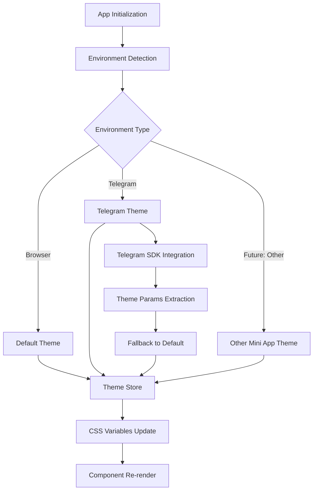
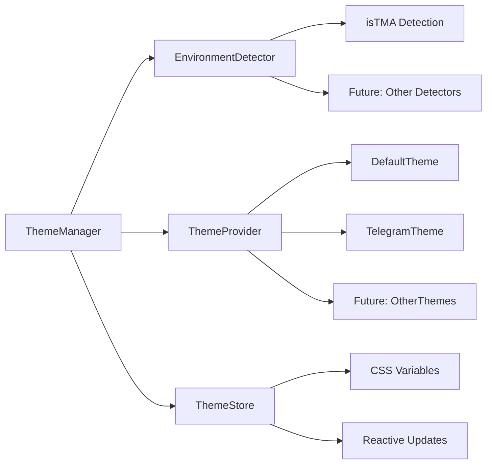

# Design Document

## Overview

Универсальная система тем предоставляет автоматическое переключение между базовой темой (для браузера) и адаптированными темами для различных мини-приложений (Telegram, и потенциально других в будущем). Система построена на основе CSS переменных и реактивных Svelte stores, обеспечивая плавное переключение тем без перезагрузки страницы.

## Architecture

### High-Level Architecture



### Component Architecture



## Components and Interfaces

### 1. Core Interfaces

```typescript
// Базовый интерфейс темы
interface Theme {
  name: string;
  colors: ThemeColors;
}

// Цвета темы с поддержкой fallback
interface ThemeColors {
  // Основные цвета
  primary: string;
  primaryContent: string;
  secondary: string;
  secondaryContent: string;
  accent: string;
  accentContent: string;
  
  // Фоновые цвета
  base100: string;  // основной фон
  base200: string;  // вторичный фон
  base300: string;  // третичный фон
  baseContent: string; // основной текст
  
  // Семантические цвета
  info: string;
  infoContent: string;
  success: string;
  successContent: string;
  warning: string;
  warningContent: string;
  error: string;
  errorContent: string;
  
  // Нейтральные цвета
  neutral: string;
  neutralContent: string;
}

// Тип окружения
type Environment = 'browser' | 'telegram' | string;

// Конфигурация темы
interface ThemeConfig {
  environment: Environment;
  colors: Partial<ThemeColors>;
  fallbackTheme: Theme;
}
```

### 2. Environment Detection

```typescript
// Детектор окружения
interface EnvironmentDetector {
  detect(): Environment;
  isSupported(env: Environment): boolean;
}

// Telegram детектор
class TelegramEnvironmentDetector implements EnvironmentDetector {
  detect(): Environment {
    // Использует isTMA() из @telegram-apps/sdk
  }
  
  isSupported(env: Environment): boolean {
    return env === 'telegram';
  }
}
```

### 3. Theme Providers

```typescript
// Базовый провайдер тем
interface ThemeProvider {
  getTheme(): Promise<Theme>;
  canProvide(env: Environment): boolean;
}

// Провайдер темы по умолчанию
class DefaultThemeProvider implements ThemeProvider {
  getTheme(): Promise<Theme> {
    // Возвращает базовую тему из DaisyUI конфигурации
  }
}

// Провайдер Telegram темы
class TelegramThemeProvider implements ThemeProvider {
  getTheme(): Promise<Theme> {
    // Получает цвета через themeParams из @telegram-apps/sdk
    // Применяет fallback для недостающих цветов
  }
}
```

### 4. Theme Store (Svelte)

```typescript
// Реактивный store для темы
interface ThemeStore {
  // Текущая тема
  current: Readable<Theme>;
  
  // Текущее окружение
  environment: Readable<Environment>;
  
  // Статус загрузки
  loading: Readable<boolean>;
  
  // Методы
  initialize(): Promise<void>;
  switchTheme(theme: Theme): void;
  updateColors(colors: Partial<ThemeColors>): void;
}
```

## Data Models

### Theme Data Flow

1. **Инициализация**: Определение окружения при загрузке приложения
2. **Получение темы**: Запрос соответствующей темы от провайдера
3. **Fallback обработка**: Заполнение недостающих цветов из базовой темы
4. **CSS обновление**: Применение цветов через CSS переменные
5. **Реактивность**: Автоматическое обновление компонентов

### Theme Color Mapping

```typescript
// Маппинг Telegram цветов в систему тем
const TELEGRAM_COLOR_MAPPING = {
  // Telegram SDK -> Theme System
  'backgroundColor': 'base100',
  'textColor': 'baseContent',
  'buttonColor': 'primary',
  'buttonTextColor': 'primaryContent',
  'secondaryBackgroundColor': 'base200',
  'headerBackgroundColor': 'base300',
  'accentTextColor': 'accent',
  'linkColor': 'info',
  'destructiveTextColor': 'error',
  'hintColor': 'neutral',
  'subtitleTextColor': 'neutralContent'
};
```

## Error Handling

### Graceful Degradation Strategy

1. **SDK недоступен**: Fallback к браузерной теме
2. **Цвета недоступны**: Использование цветов из базовой темы
3. **Ошибка инициализации**: Логирование + использование базовой темы
4. **Неподдерживаемое окружение**: Автоматический fallback к браузерной теме

### Error Recovery

```typescript
interface ThemeErrorHandler {
  handleSDKError(error: Error): Theme;
  handleColorMissing(colorKey: string): string;
  handleInitializationError(error: Error): Theme;
}
```

## Testing Strategy

### Unit Tests

1. **Environment Detection**
   - Тестирование определения Telegram окружения
   - Тестирование fallback к браузеру
   - Мокирование isTMA() функции

2. **Theme Providers**
   - Тестирование получения цветов из Telegram SDK
   - Тестирование fallback логики
   - Тестирование базовой темы

3. **Theme Store**
   - Тестирование реактивности
   - Тестирование переключения тем
   - Тестирование состояний загрузки

### Integration Tests

1. **End-to-End Theme Switching**
   - Тестирование полного цикла переключения тем
   - Тестирование CSS переменных обновления
   - Тестирование компонентов рендеринга

2. **Telegram SDK Integration**
   - Мокирование Telegram окружения
   - Тестирование получения theme params
   - Тестирование обработки ошибок SDK

### Component Tests

1. **Theme-aware Components**
   - Тестирование использования CSS переменных
   - Тестирование адаптации к разным темам
   - Тестирование accessibility

## Implementation Details

### File Structure

```
src/lib/theme/
├── index.ts                 # Public API
├── types.ts                 # TypeScript интерфейсы
├── store.ts                 # Svelte theme store
├── manager.ts               # ThemeManager класс
├── detectors/
│   ├── base.ts             # Базовый детектор
│   ├── telegram.ts         # Telegram детектор
│   └── browser.ts          # Browser детектор
├── providers/
│   ├── base.ts             # Базовый провайдер
│   ├── default.ts          # Провайдер по умолчанию
│   └── telegram.ts         # Telegram провайдер
└── utils/
    ├── css-vars.ts         # Утилиты для CSS переменных
    ├── color-utils.ts      # Утилиты для работы с цветами
    └── fallback.ts         # Fallback логика
```

### CSS Variables Strategy

Система будет использовать существующие DaisyUI CSS переменные, расширяя их для поддержки динамического переключения:

```css
:root {
  /* Базовые цвета DaisyUI */
  --color-primary: var(--theme-primary, oklch(45% 0.24 277.023));
  --color-base-100: var(--theme-base-100, oklch(100% 0 0));
  /* ... остальные цвета */
  
  /* Динамические переменные темы */
  --theme-primary: /* устанавливается JS */;
  --theme-base-100: /* устанавливается JS */;
  /* ... */
}
```

### Performance Considerations

1. **Lazy Loading**: Провайдеры тем загружаются только при необходимости
2. **Caching**: Кэширование полученных тем для избежания повторных запросов
3. **Debouncing**: Дебаунсинг обновлений CSS переменных
4. **Minimal Re-renders**: Оптимизация Svelte store для минимальных перерендеров

### Accessibility

1. **Color Contrast**: Проверка контрастности цветов
2. **High Contrast Mode**: Поддержка режима высокой контрастности
3. **Reduced Motion**: Учет предпочтений пользователя по анимациям
4. **Screen Readers**: Корректная работа с программами чтения экрана